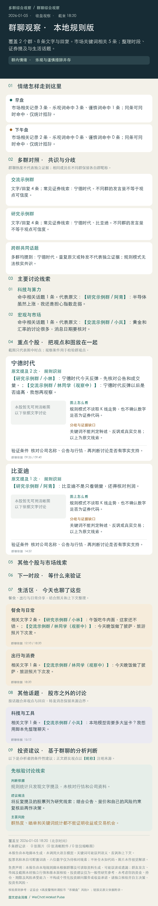

# WeChat Market Pulse · 微信群聊综合简报

把自己本机微信群的文字、回复和图片，整理成适合分享的中文总结长图。支持单群、多群合并、早盘/下午盘/全天，保留【最新群昵称】、观点来源、个股讨论、生活与其他话题。

**Windows 和 macOS 共用一套 Python 程序。** 可选 GPT、其他云端模型、Ollama / LM Studio / vLLM 本地模型，也能完全不使用大语言模型。安装后，`wechat-pulse demo` 无需微信、模型、密钥或网络即可运行。

独立社区项目，与腾讯、微信、OpenAI 无官方关联。实时读取面向**自己电脑上、自己已登录的微信 4.x 账号**。首次读取加密数据库还需本机初始化；版本、系统权限和同步范围会影响可用性，不能保证所有微信版本仅登录后就能直接读取。详见 [安装指南](docs/INSTALL.md) 和 [验证范围](docs/VALIDATION.md)。

## 先跑完整示例

需要 Python 3.11–3.14（推荐 64 位 3.13）和 Git。

```bash
git clone https://github.com/yx3110/wechat-market-pulse.git
cd wechat-market-pulse
```

macOS：

```bash
bash scripts/install-macos.sh
open ./demo-output/briefing.html
```

Windows PowerShell：

```powershell
powershell -NoProfile -ExecutionPolicy Bypass -File .\scripts\install-windows.ps1
Start-Process .\demo-output\briefing.html
```

安装脚本会选择已有的受支持 Python，创建项目虚拟环境并验收 demo；已有环境不重复创建。手动安装可用所选解释器运行 `-m venv .venv`，再用环境内 Python 执行 `-m pip install -e '.[media]'`。中文字体随安装包提供。`[media]` 添加 HEVC/WXGF 图片解码；纯文字、PNG/JPEG 和规则分析可用基础安装。

<details>
<summary>查看虚构的两群示例长图（纯脚本模式，无真实聊天）</summary>



</details>

## 读取自己的群

以下命令使用虚拟环境中的 `wechat-pulse`；激活环境后可直接使用命令名。

```bash
wechat-pulse init                         # 默认规则模式，零模型费用
wechat-pulse doctor
wechat-pulse setup-wechat                 # 已有有效密钥时自动跳过
wechat-pulse groups --prefix '研究'
wechat-pulse report --group-id '你的群ID@chatroom'

# 只导出，不请求模型
wechat-pulse export --group-id '你的群ID@chatroom' --date 2026-01-05 --output ./chat.jsonl

# 多群合并；每个 --group-id 代表一个明确选择的群
wechat-pulse report --group-id '群甲ID@chatroom' --group-id '群乙ID@chatroom' --period morning

# 默认每 30 秒收集消息、每五分钟刷新报告；保持电脑和微信运行
wechat-pulse watch --group-id '你的群ID@chatroom'
wechat-pulse start --group-id '你的群ID@chatroom'  # 后台运行
wechat-pulse status
wechat-pulse stop
```

macOS 初始化可能重开本地辅助微信副本并出现系统授权框；无需关闭 SIP，也不重签原版微信。Windows 只读扫描当前用户微信进程并验证数据库密钥。未适配版本可改用已有 JSONL 导出，详见 [INSTALL.md](docs/INSTALL.md)。

报告时段按北京时间：盘前 00:00–09:30、早盘 09:30–11:30、午间 11:30–13:00、下午盘 13:00–15:00、盘后 15:00–24:00。模型任务不重叠；更新延迟取决于微信写盘、复制数据库和推理速度，不是服务器消息推送。

## 选择分析方式

| 方式 | 预设 | 运行位置 | 图片解读 |
| --- | --- | --- | --- |
| 无大模型 | `rules` | 本机脚本 | 统计附件，明确标记未解析 |
| 已登录 Codex CLI | `codex` | 云端 | 支持 |
| GPT / OpenAI API | `openai` | 云端 | 使用支持视觉的模型 |
| DeepSeek、Qwen、兼容接口 | `deepseek` / `qwen` / `openai-compatible` | 指定服务 | 按模型能力配置 |
| Ollama | `ollama` | 本机 | 选择视觉模型并声明能力 |
| LM Studio / vLLM | `lmstudio` / `vllm` | 本机 | 按模型能力配置 |

```bash
# 首次配置选择其一
wechat-pulse init --provider codex
wechat-pulse init --provider ollama --model 'ollama list 中的模型名称'

# 单次切换，不改变保存的配置
wechat-pulse report --group-id '你的群ID@chatroom' --provider rules
wechat-pulse models
```

已有配置时请编辑原配置，或用 `init --force` 明确替换。文字与视觉可使用不同模型；API 环境变量、开源模型、小内存机器和离线部署见 [MODELS.md](docs/MODELS.md)。Codex 可使用订阅登录；直接 API 使用独立的 API 计费。[官方认证说明](https://learn.chatgpt.com/docs/auth)、[非交互调用](https://learn.chatgpt.com/docs/non-interactive-mode)。

## 输出和证据

- 综合情绪演变、主要讨论线索、个股观点/图证/分歧/验证条件。
- 多群对照并保留来源群。同一账号在不同群用各自群昵称，不同账号同名不合并。
- 生活图文和股市之外的讨论分区展示；一般性研究建议与群友观点分开，并附免责声明。
- 只改昵称时刷新正文、配图署名和依据，复用原分析；原消息和截图中的历史文字不改写。
- 可选[标的外部补查](docs/MARKET_RESEARCH.md)：缺少指引时补查日线和近期消息，在标的旁边展示来源、数据日期及对群观点的影响。支持商品参考基准；离线/规则模式保持不联网。
- [重点成员关注](docs/FOCUS_MEMBERS.md)：按“群 + 稳定账号”关注指定成员，独立整理观点、标的和变化；改昵称继续识别，无发言时明确标记，不混入同名账号或其他群。

规则模式提供时段统计、词表命中、证券提及和有来源的原文摘录，不凭关键词猜 K 线。六位数字仅为待核对线索。图片缺失、仅缩略图、未启用视觉模型均明确记录。

长聊天分段归纳后综合，保留并校验原始证据编号。不同模型使用各自缓存。像素完全相同的回流报告可以排除；缩放、裁切或有损压缩后的回流不保证识别。结构校验不等于事实或行情核验。

每次输出 PNG、`briefing.json`、`briefing.html` 和 `briefing-sources.html`。默认保存在系统用户数据目录，可用全局 `--home` 指定私有运行目录。

```bash
wechat-pulse render --report '/报告目录/briefing.json'
wechat-pulse refresh-names --report '/报告目录/briefing.json'
wechat-pulse report --input ./examples/messages.jsonl --date 2026-01-05 --provider rules
```

## 保存与发送

打开 `briefing.html` 查看或保存原图。可选 Tailscale Taildrop，发送核对过的原文件到自己的设备，不压缩、不经公共图床。

```bash
tailscale file cp --targets
wechat-pulse send '/报告.png' --target '自己的设备名' --sha256 '完整SHA256'
```

回执区分完成、失败和未确认；相同目标和文件哈希不重复发送。传输完成不代表已阅读。项目不自动给群成员发消息。

也保留了基于腾讯公开 iLink 协议的 ClawBot 本人会话发送器，无需控制桌面鼠标。它需要单独扫码绑定，不能把桌面微信登录当作 Bot 登录；可用性受服务端接入和 CDN 状态影响。命令和回执含义见 [DELIVERY.md](docs/DELIVERY.md)。

## 交给编程助手安装

把链接和下面这段交给 Codex、Claude Code、Cursor、Cline 等工具：

> 请阅读 README.md、AGENTS.md 和 docs/AGENT_GUIDE.md，为当前系统安装 WeChat Market Pulse。先运行无需账号的 demo 和 doctor，保留已有配置，按我的选择连接规则、本地或云端模型，再初始化本机已登录微信并列出群供我选择。密钥只留本机，错误反馈只提供脱敏状态；不要把运行目录和真实数据提交到 GitHub。使用 --json 获取可解析结果，并核对实际图片。

[AGENT_GUIDE.md](docs/AGENT_GUIDE.md) 提供探测顺序、命令和故障定位；[llms.txt](llms.txt) 是文档入口。

## 开发

```bash
python -m pip install -e '.[dev,media]'
python -m pytest -q
ruff check src tests
python -m build
```

源代码是唯一实现，运行数据通过 `--home` 隔离。CI 覆盖 Windows、macOS、Linux 多个 Python 版本；真实设备和模型验证范围见 [VALIDATION.md](docs/VALIDATION.md)。代码 MIT，第三方许可见 [THIRD_PARTY.md](THIRD_PARTY.md)，数据边界见 [SECURITY.md](SECURITY.md)。报告只作信息整理和一般性研究参考，不构成个性化投资建议或收益承诺。
